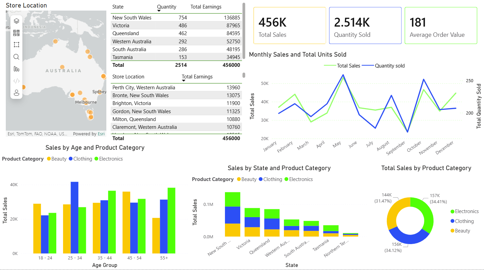

# Retail Sales Performance Dashboard (Power BI)

## Overview

This project presents an interactive Power BI dashboard analysing retail sales performance across geography, product categories, customer demographics and time.

The objective of this analysis is to explore key sales patterns and identify areas where retail managers could focus their efforts to improve revenue and customer engagement.

The dashboard enables stakeholders to quickly understand:
* which regions generate the most revenue
* which product categories drive sales
* which customer segments contribute the most to purchases
* how sales trends evolve over time

The report is designed to support high-level decision making and performance monitoring.

## Dashboard Preview



## Business Questions

This dashboard was built to explore several key business questions:
1. Which states contribute the most to overall retail sales?
2. How does product category performance vary across regions?
3. Which customer age groups generate the highest revenue?
4. Are there noticeable trends in sales and purchase quantities over time?
5. Which store locations perform best within each state?

Answering these questions helps retail managers identify high-performing regions, key customer segments and potential areas for sales growth.

## Key Features

From the analysis presented in the dashboard:

- **Sales concentration**: Revenue is largely concentrated in a few states, indicating that certain regions drive the majority of sales performance.
- **Category performance**: Electronics and Clothing contribute the largest share of total sales across most regions.
- **Customer demographics**: Customers between the ages of 25-44 generate the highest volume of purchases, suggesting this segment may represent the core customer base.
- **Consistent demand over time**: Monthly sales remain relatively stable throughout the year, indicating steady demand across product categories.

## Business Recommendations
Based on the analysis, several actions could be considered:
- Focus marketing campaigns on high-value customer segments, particularly customers aged 25-44.
- Investigate strategies used in top-performing regions and replicate them in lower-performing areas.
- Prioritize inventory and promotions for high-performing product categories such as electronics.
- Continue monitoring monthly sales trends to identify potential seasonal patterns or emerging demand shifts.

## Tools and Technologies

This project uses:

- Power BI
- ArcGIS Maps for Power BI
- R for data enrichment and location generation

## Data

The dataset used in this project is a synthetic retail sales dataset containing:

- transaction records
- product categories
- customer demographics
- sales amounts and quantities

Store locations were generated programmatically to simulate Australian retail outlets.

## Repository Structure

```text
powerbi-retail-sales-dashboard
│
├── dashboard
│   └── retail_sales_dashboard.pbix
├── images
│   └── dashboard_preview.png
└── scripts
    └── generate_locations.R
```
## How to Use

1. Download the `.pbix` file from the **dashboard** folder.
2. Open it using **Power BI Desktop**.
3. Interact with the visuals by selecting states and exploring the linked charts and tables.

---

## Purpose of the Project

This project demonstrates how business intelligence tools such as Power BI can be used to transform transactional data into an interactive reporting dashboard that supports data-driven decision making.

The focus of the project is on dashboard design, business metric reporting and interactive data exploration rather than advanced statistical modelling.

More advanced statistical analysis and modelling are demonstrated in other repositories.
